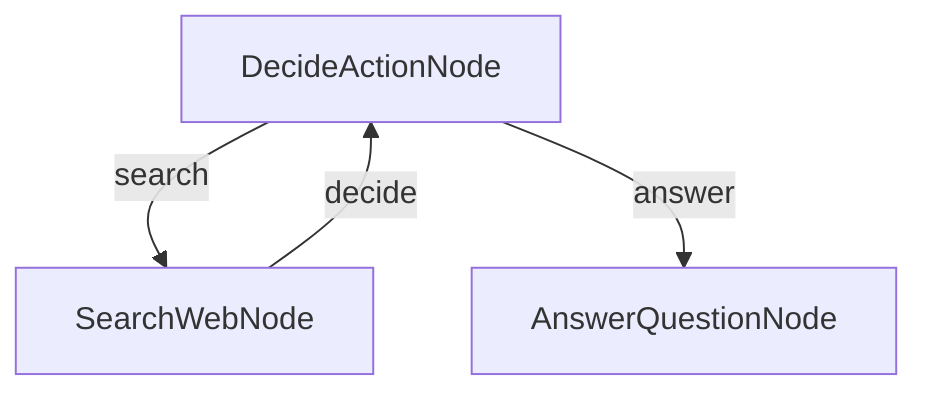

# Research Agent (C#)

A simple LLM-powered research agent built with **PocketFlow** for C#. The agent decides when to search the web and when it has enough information to answer, looping until it produces a confident final answer.

> Ported from the original Python cookbook at `cookbook/pocketflow-agent`.

---

## How It Works



| Node | Responsibility |
|---|---|
| `DecideActionNode` | Calls the LLM to decide whether to search the web or answer directly |
| `SearchWebNode` | Queries DuckDuckGo (top 5 results) and appends findings to shared context |
| `AnswerQuestionNode` | Calls the LLM with all gathered context to produce the final answer |

---

## Requirements

- [.NET 10 SDK](https://dotnet.microsoft.com/download)
- [Ollama](https://ollama.com/) running locally (or reachable via `OLLAMA_HOST`)

---

## Getting Started

### 1. Pull a model

```bash
ollama pull llama3
```

### 2. Configure environment variables (optional)

| Variable | Default | Description |
|---|---|---|
| `OLLAMA_HOST` | `http://localhost:11434` | Ollama server URL |
| `OLLAMA_MODEL` | `llama3:latest` | Model to use for all LLM calls |

```bash
export OLLAMA_HOST="http://localhost:11434"
export OLLAMA_MODEL="llama3:latest"
```

### 3. Run with the default question

```bash
dotnet run --project src/Agent
```

### 4. Ask your own question

Prefix your question with `--`:

```bash
dotnet run --project src/Agent -- --"What is quantum computing?"
```

---

## Project Structure

| File | Description |
|---|---|
| `Program.cs` | Entry point - reads CLI args, wires nodes, runs the flow |
| `Nodes.cs` | `DecideActionNode`, `SearchWebNode`, `AnswerQuestionNode` |
| `Utils.cs` | `CallLlm` (OllamaSharp) and `SearchWebDuckDuckGo` (raw HttpClient) |
| `Agent.csproj` | Project file - references PocketFlow, SharedUtils, YamlDotNet |

---

## Dependencies

| Package | Purpose |
|---|---|
| `PocketFlow` | Graph-based flow orchestration |
| `SharedUtils` / `OllamaSharp` | Local LLM inference via Ollama |
| `YamlDotNet` | Parse structured YAML responses from the LLM |

