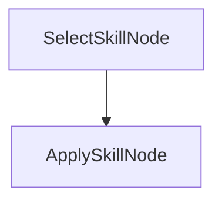

# Agent Skills with PocketFlow (C#)

This example shows a lightweight pattern for using **Agent Skills** inside a PocketFlow graph.

Agent Skills are reusable instruction files (Markdown) that are selected and applied at runtime.

## What this demo does

- Keeps skills as local Markdown files (`./skills/*.md`)
- Chooses a skill based on the user request (keyword routing)
- Injects the chosen skill into the final LLM prompt

## Flow



1. **SelectSkillNode** picks a skill file (e.g. `executive_brief` vs `checklist_writer`)
2. **ApplySkillNode** reads that skill and executes the task with the LLM (Ollama)

## Prerequisites

- [Ollama](https://ollama.com/) running locally on `http://localhost:11434`
- A compatible model pulled (default: `gemma3:latest`)
- .NET 10 SDK

## Run

```bash
dotnet run
```

Custom task:

```bash
dotnet run -- --"Summarize this launch plan for a VP audience"
dotnet run -- --"Turn this into an implementation checklist"
```

## Files

| File | Description |
|------|-------------|
| `Program.cs` | CLI entry point and flow wiring (mirrors `main.py` + `flow.py`) |
| `Nodes.cs` | `SelectSkillNode` and `ApplySkillNode` (mirrors `nodes.py`) |
| `Utils.cs` | `LoadSkills` and `CallLlm` helpers (mirrors `utils.py`) |
| `skills/*.md` | Reusable Agent Skill instruction files |

## Configuration

| Environment variable | Default | Purpose |
|----------------------|---------|---------|
| `OLLAMA_HOST`  | `http://localhost:11434` | Ollama server URL |
| `OLLAMA_MODEL` | `gemma3:latest`          | Chat model to use |

