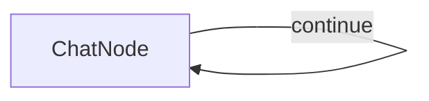

# Simple PocketFlow Chat

A basic chat application using PocketFlow with [Ollama](https://ollama.com) via **OllamaSharp**.

## Features

- Conversational chat interface in the terminal
- Maintains full conversation history for context
- Simple implementation demonstrating PocketFlow's node and flow concepts

## Run It

1. Make sure [Ollama](https://ollama.com) is running locally and the desired model is pulled:
    ```bash
    ollama pull llama3.2
    ```

2. Optionally configure the host and model via environment variables:
    ```bash
    export OLLAMA_HOST="http://localhost:11434"   # default
    export OLLAMA_MODEL="llama3.2"                # default
    ```

3. Build and run the application:
    ```bash
    dotnet run --project Chat.csproj
    ```

## How It Works



The chat application uses:
- A single `ChatNode` with a self-loop that:
    - Takes user input in the `Prep` method
    - Sends the complete conversation history to Ollama
    - Adds responses to the conversation history
    - Loops back to continue the chat until the user types `exit`

## Files

- [`Program.cs`](./Program.cs): Implementation of the `ChatNode`, `Utils.CallLlm`, and chat flow
- [`Chat.csproj`](./Chat.csproj): Project file with OllamaSharp and PocketFlow references
