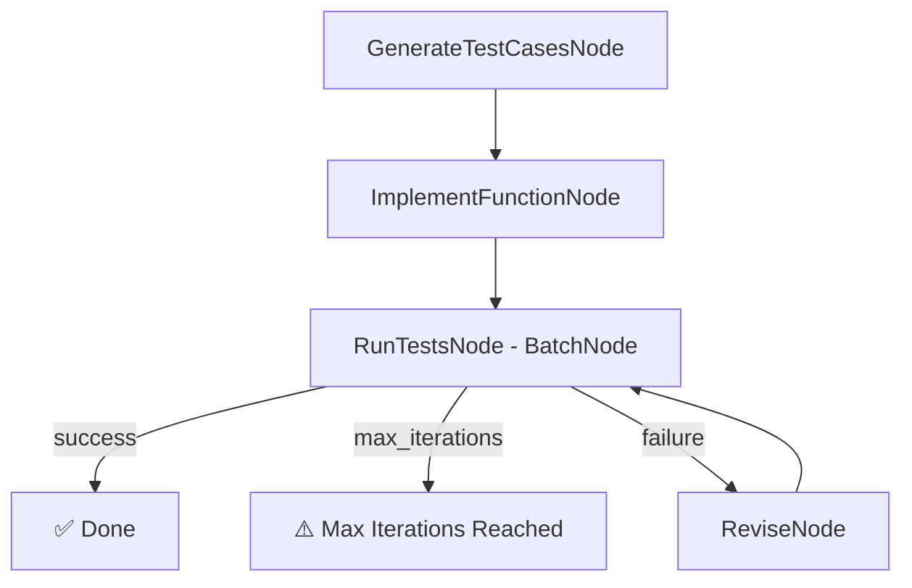

# PocketFlow Code Generator (C#)

An intelligent AI system that takes LeetCode-style coding problems, automatically generates comprehensive test cases, implements solutions as C# methods, compiles and executes them in-process with **Roslyn**, then iteratively improves the code until all tests pass.

> Ported from the original Python cookbook at `cookbook/pocketflow-code-generator`.

---

## How It Works



| Node | Base | Responsibility |
|---|---|---|
| `GenerateTestCasesNode` | `Node` | Prompts the LLM for 5–7 C# test cases; parses YAML; writes `shared["test_cases"]` |
| `ImplementFunctionNode` | `Node` | Prompts the LLM for a `public static object RunCode(...)` method; parses YAML; writes `shared["function_code"]` |
| `RunTestsNode` | `BatchNode` | Compiles the method with Roslyn, invokes it per test case, returns `"success"` / `"failure"` / `"max_iterations"` |
| `ReviseNode` | `Node` | Analyses failures; prompts the LLM to revise test cases and/or the function; patches shared state |

### Key Design Decisions vs the Python original

| Concern | Python original | This C# port |
|---|---|---|
| LLM backend | Anthropic Claude (`ANTHROPIC_API_KEY`) | Ollama via `OllamaConnector` (`OLLAMA_HOST` / `OLLAMA_MODEL`) |
| Code execution | `exec()` + `run_code(**kwargs)` | Roslyn in-process compilation + reflection |
| Generated function name | `def run_code(...)` | `public static object RunCode(...)` |
| Argument passing | Python `**kwargs` | JSON round-trip for type conversion (`List<object>` → `int[]`, etc.) |
| Value comparison | Python `==` | `JsonSerializer`-normalised string comparison |

---

## Requirements

- [.NET 10 SDK](https://dotnet.microsoft.com/download)
- [Ollama](https://ollama.com/) running locally (or reachable via `OLLAMA_HOST`)

---

## Getting Started

### 1. Pull a model

```bash
ollama pull llama3
```

### 2. Configure environment variables (optional)

| Variable | Default | Description |
|---|---|---|
| `OLLAMA_HOST` | `http://localhost:11434` | Ollama server URL |
| `OLLAMA_MODEL` | `llama3:latest` | Model used for all LLM calls |

```bash
export OLLAMA_HOST="http://localhost:11434"
export OLLAMA_MODEL="llama3:latest"
```

### 3. Run with the default Two Sum problem

```bash
dotnet run --project src/CodeGenerator
```

### 4. Supply your own problem

Pass the problem description as CLI arguments:

```bash
dotnet run --project src/CodeGenerator -- "Reverse a string. Given a string s, return it reversed."
```

---

## Sample Output

```
Starting PocketFlow Code Generator...

🧪 Generating test cases...

=== Generated 6 Test Cases ===
1. Basic case - solution at start
   input:    { nums = [2, 7, 11, 15], target = 9 }
   expected: [0, 1]
...

⚙️  Implementing C# solution...

=== Implemented Function ===
public static object RunCode(int[] nums, int target)
{
    var map = new Dictionary<int, int>();
    for (var i = 0; i < nums.Length; i++)
    {
        var complement = target - nums[i];
        if (map.TryGetValue(complement, out var j))
            return new int[] { j, i };
        map[nums[i]] = i;
    }
    return new int[] {};
}

=== Test Results: 6/6 Passed ===

=== Final Results ===
Problem:    Two Sum  Given an array of integers nums and an...
Iterations: 1
Function:
public static object RunCode(int[] nums, int target)
{
    ...
}
Test Results: 6/6 passed
```

---

## Project Structure

| File | Description |
|---|---|
| `Program.cs` | Entry point — wires nodes, initialises shared state, reads CLI args, runs flow, prints summary |
| `Nodes.cs` | `GenerateTestCasesNode`, `ImplementFunctionNode`, `RunTestsNode`, `ReviseNode`; shared `YamlHelper` |
| `Utils.cs` | `CallLlm` (OllamaSharp wrapper), `ExecuteCode` (Roslyn compile + invoke), `ValuesEqual` (JSON comparison) |
| `CodeGenerator.csproj` | Project file — references PocketFlow, SharedUtils, Roslyn, YamlDotNet |

---

## Dependencies

| Package | Purpose |
|---|---|
| `PocketFlow` | Graph-based flow orchestration (`Node`, `BatchNode`, `Flow`) |
| `SharedUtils` / `OllamaSharp` | Local LLM inference via Ollama |
| `Microsoft.CodeAnalysis.CSharp` | In-process Roslyn compilation and execution of generated C# methods |
| `YamlDotNet` | Two-pass YAML parsing of structured LLM responses |

---

## Design Patterns Used

- **[Workflow](https://the-pocket.github.io/PocketFlow/design_pattern/workflow.html)** — sequential steps of generate → implement → test
- **[Agent](https://the-pocket.github.io/PocketFlow/design_pattern/agent.html)** — `ReviseNode` makes intelligent decisions about whether to fix the tests, the code, or both
- **[Batch](https://the-pocket.github.io/PocketFlow/core_abstraction/batch.html)** — `RunTestsNode` compiles once and runs every test case through the same method
- **[Structured Output](https://the-pocket.github.io/PocketFlow/design_pattern/structure.html)** — all LLM interactions use YAML with a two-pass fallback parser

