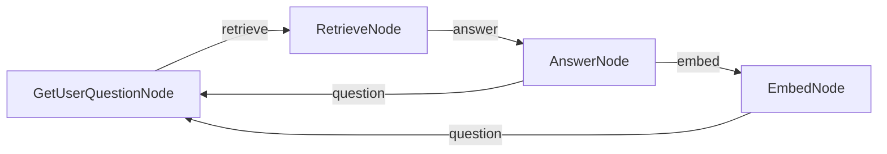

# PocketFlow Chat with Memory

A chat application with memory retrieval using PocketFlow. This example maintains a sliding window of recent conversations while retrieving relevant past conversations based on context.

This C# implementation is a port of the [pocketflow-chat-memory](../../cookbook/pocketflow-chat-memory) Python example and uses [Ollama](https://ollama.com) via **OllamaSharp** instead of OpenAI.

## Features

- Maintains a window of 3 most recent conversation pairs
- Archives older conversations with embeddings (in-memory pure C# vector index)
- Uses vector similarity (L2 distance) to retrieve the most relevant past conversation
- Combines recent context (3 pairs) with retrieved context (1 pair) for better responses

## Run It

1. Make sure [Ollama](https://ollama.com) is running locally and the required models are pulled:
    ```bash
    ollama pull gemma3:latest
    ollama pull embeddinggemma
    ```

2. Optionally configure the host and models via environment variables:
    ```bash
    export OLLAMA_HOST="http://localhost:11434"   # default
    export OLLAMA_MODEL="gemma3:latest"           # default
    export OLLAMA_EMBED_MODEL="embeddinggemma"    # default
    ```

3. Build and run the application:
    ```bash
    dotnet run --project Memory.csproj
    ```

## How It Works



The chat application uses four specialised nodes:

| Node | Responsibility |
|------|----------------|
| `GetUserQuestionNode` | Reads user input from the console and appends a `User` message |
| `RetrieveNode` | Embeds the latest user message and performs an L2 nearest-neighbour search over the archived conversations |
| `AnswerNode` | Builds a prompt from the 3 most recent pairs + 1 retrieved pair, calls the LLM, and decides whether to archive |
| `EmbedNode` | Pops the oldest conversation pair off the sliding window, embeds it, and saves it to the in-memory vector archive |

### Sliding-window memory

```
Active messages  ──────────────────────────────────►  Archive (VectorItem list)
[pair1, pair2, pair3]  ──overflow──►  pair1 embedded ──► stored in vector_items
```

When `shared["messages"]` grows beyond 6 entries (3 pairs) after an answer, `AnswerNode` returns `"embed"` instead of `"question"`, triggering `EmbedNode` to move the oldest pair into the archive before looping back.

## Files

- [`Nodes.cs`](./Nodes.cs): `GetUserQuestionNode`, `RetrieveNode`, `AnswerNode`, `EmbedNode`, and `VectorItem`
- [`Program.cs`](./Program.cs): Flow wiring and entry point
- [`Memory.csproj`](./Memory.csproj): Project file with PocketFlow and SharedUtils references

## Example Output

```
==================================================
PocketFlow Chat with Memory
==================================================
This chat keeps your 3 most recent conversations
and brings back relevant past conversations when helpful
Type 'exit' to end the conversation
==================================================
Welcome to the interactive chat! Type 'exit' to end the conversation.

You: remember, my cat name is Whiskers and she only drinks from running water taps

A: Got it! Whiskers only drinks from running water taps. I'll keep that in mind!

You: remember, I have a peanut allergy but I can eat almonds and cashews without problems

A: Understood! Peanut allergy, but almonds and cashews are fine. Noted!

You: remember, my anniversary is June 17th and I always forget to buy a gift until the last minute

A: Got it! Anniversary on June 17th, last-minute gift tendency. I'll remind you if you ask!

You: remember, I lived in Portugal for 3 years when I was a child and still speak some Portuguese

A: That's great! Childhood in Portugal, still speak some Portuguese. Very cool!
✅ Added conversation to index at position 0
✅ Index now contains 1 conversations

You: what's my cat name?
🔍 Finding relevant conversation for: what's my cat name?...
📄 Retrieved conversation (distance: 0.3821)

A: Your cat's name is Whiskers.
✅ Added conversation to index at position 1
✅ Index now contains 2 conversations
```

