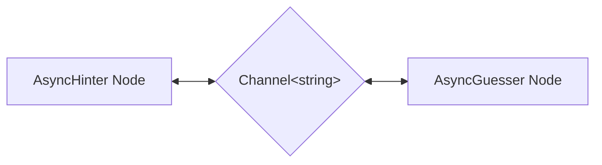

# Multi-Agent Taboo Game

A PocketFlow C# example that demonstrates asynchronous multi-agent communication using the Taboo word-guessing game.

## Features

- Two AI agents (`AsyncHinter` and `AsyncGuesser`) run concurrently as independent `AsyncFlow` pipelines
- Agents communicate exclusively through `System.Threading.Channels.Channel<string>` — the C# equivalent of `asyncio.Queue`
- Shared state is carried by a strongly-typed `GameState` record class instead of a loosely-typed dictionary
- `AsyncHinter` validates LLM output and **retries up to 3 times** if the hint contains a forbidden word, using the built-in `AsyncNode` retry mechanism
- The game terminates automatically when the guesser produces the correct word

## How It Works



| Component | Role |
|-----------|------|
| **AsyncHinter** | Reads a guess from `HinterChannel`, builds a ≤ 5-word hint via the LLM (retrying if forbidden words slip through), and writes the hint to `GuesserChannel` |
| **AsyncGuesser** | Reads a hint from `GuesserChannel`, asks the LLM for a single-word guess, then writes the guess back to `HinterChannel` (or signals `"GAME_OVER"`) |
| **Channel\<string\>** | Lock-free async FIFO queues — `HinterChannel` carries guesses → hinter; `GuesserChannel` carries hints → guesser |

### Turn sequence

```
Program seeds HinterChannel with ""
       │
       ▼
AsyncHinter ──hint──► GuesserChannel ──► AsyncGuesser
    ▲                                         │
    └──────────── HinterChannel ◄─────────────┘
                    (guess or GAME_OVER)
```

## Files

| File | Description |
|------|-------------|
| [`Program.cs`](./Program.cs) | Entry point: builds `GameState`, wires the self-looping flows, and runs both concurrently with `Task.WhenAll` |
| [`Nodes.cs`](./Nodes.cs) | `GameState` record · `AsyncHinter` · `AsyncGuesser` |
| [`Utils.cs`](./Utils.cs) | `Utils.CallLlm` — thin wrapper around `OllamaConnector` |

## Prerequisites

- [.NET 10 SDK](https://dotnet.microsoft.com/download)
- [Ollama](https://ollama.com/) running locally on `http://localhost:11434`

```bash
ollama pull gemma3   # or set OLLAMA_MODEL env var to any chat model
```

## Configuration

| Environment variable | Default | Purpose |
|----------------------|---------|---------|
| `OLLAMA_HOST` | `http://localhost:11434` | Ollama server URL |
| `OLLAMA_MODEL` | `gemma3:latest` | Chat model for hints and guesses |

## Running

```bash
cd src/MultiAgent
dotnet run
```

## Example Output

```
=========== Taboo Game Starting! ===========
Target word: nostalgic
Forbidden words: [memory, past, remember, feeling, longing]
============================================

Hinter: Here's your hint - Sentiment for earlier times.
Guesser: I guess it's - Nostalgia

Hinter: Here's your hint - Yearning for days gone by.
Guesser: I guess it's - Reminiscence

Hinter: Here's your hint - Wistful fondness for simpler times.
Guesser: I guess it's - Sentimentality

Hinter: Here's your hint - Reliving cherished earlier experiences.
Guesser: I guess it's - Nostalgic
Game Over - Correct guess!

=========== Game Complete! ===========
```

