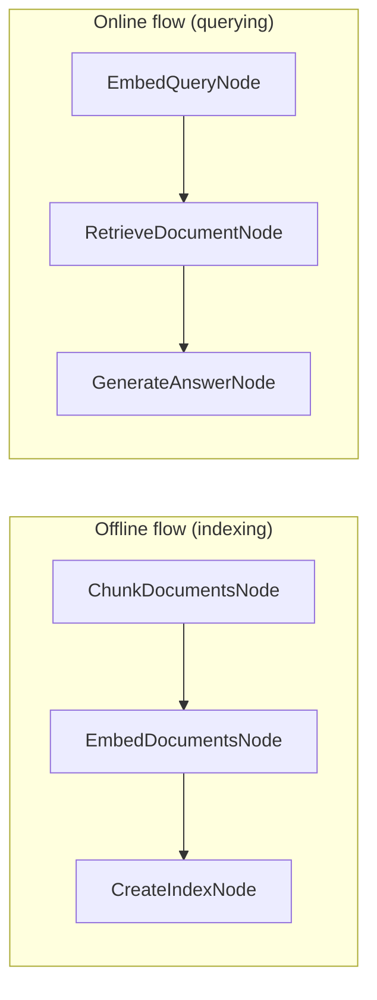

# RAG — Retrieval-Augmented Generation (C#)

A minimal RAG pipeline built with **PocketFlow** for C#.  
Documents are chunked, embedded, and indexed **once** (offline). At query time the
most relevant chunk is retrieved with a nearest-neighbour search and passed to the
LLM to produce a grounded answer.

> Ported from the original Python cookbook at `cookbook/pocketflow-rag`.

---

## How It Works

Two flows share a single `Dictionary<string, object>` store.



### Node reference

| Node | Type | Responsibility |
|---|---|---|
| `ChunkDocumentsNode` | `BatchNode` | Splits each document into fixed-size character chunks (default 2 000 chars) |
| `EmbedDocumentsNode` | `BatchNode` | Embeds each chunk with the configured embedding model |
| `CreateIndexNode` | `Node` | Stores the `List<float[]>` embedding list as the in-memory index |
| `EmbedQueryNode` | `Node` | Embeds the query string |
| `RetrieveDocumentNode` | `Node` | Finds the nearest chunk via linear squared-L2 search (replaces FAISS) |
| `GenerateAnswerNode` | `Node` | Calls the LLM with the retrieved chunk as context |

---

## Requirements

- [.NET 10 SDK](https://dotnet.microsoft.com/download)
- [Ollama](https://ollama.com/) running locally (or reachable via `OLLAMA_HOST`)

---

## Getting Started

### 1. Pull the required models

```bash
# Chat / answer generation
ollama pull llama3

# Embedding
ollama pull nomic-embed-text
```

### 2. Configure environment variables (optional)

| Variable | Default | Description |
|---|---|---|
| `OLLAMA_HOST` | `http://localhost:11434` | Ollama server URL |
| `OLLAMA_MODEL` | `llama3:latest` | Chat model used by `GenerateAnswerNode` |
| `OLLAMA_EMBED_MODEL` | `nomic-embed-text` | Embedding model used by `EmbedDocumentsNode` and `EmbedQueryNode` |

```bash
export OLLAMA_HOST="http://localhost:11434"
export OLLAMA_MODEL="llama3:latest"
export OLLAMA_EMBED_MODEL="nomic-embed-text"
```

### 3. Run with the default query

```bash
dotnet run --project src/Rag
```

### 4. Ask your own question

Prefix your question with `--`:

```bash
dotnet run --project src/Rag -- --"What is Q-Mesh used for?"
```

---

## Project Structure

| File | Description |
|---|---|
| `Program.cs` | Entry point — sample texts, CLI arg parsing, flow wiring, execution |
| `Nodes.cs` | All six node classes (offline + online) |
| `Utils.cs` | `CallLlm`, `GetEmbedding` (OllamaSharp), `FixedSizeChunk` |
| `Rag.csproj` | Project file — references `PocketFlow` and `SharedUtils` |

---

## Key Differences from the Python Version

| Concern | Python | C# |
|---|---|---|
| LLM / embeddings | OpenAI SDK (`gpt-4o`, `text-embedding-ada-002`) | OllamaSharp — fully local, model configurable via env vars |
| Vector index | `faiss.IndexFlatL2` | Pure C# linear scan over `List<float[]>` (squared L2) |
| Embedding type | `numpy.ndarray` (`float32`) | `float[]` |
| Async bridging | native async | `Task.Run(...).GetAwaiter().GetResult()` to keep nodes synchronous |

The linear search is O(n) but perfectly adequate for the five sample documents in
this demo. For larger corpora, drop in any nearest-neighbour library and swap out
`RetrieveDocumentNode.Exec`.

