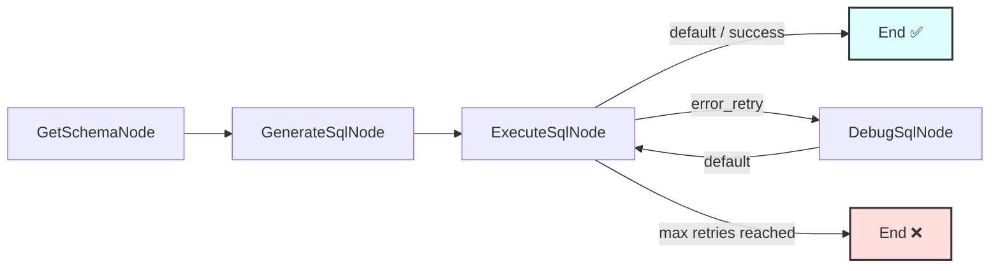

# Text-to-SQL Workflow

A PocketFlow C# example demonstrating a text-to-SQL workflow that converts natural language questions into executable SQL queries for a SQLite database, including an LLM-powered debugging loop for failed queries.

## Features

- **Schema Awareness** – Automatically retrieves the database schema to provide context to the LLM.
- **LLM-Powered SQL Generation** – Uses an LLM (Ollama / `gemma3:latest` by default) to translate natural language into SQLite queries, expecting YAML-formatted output.
- **Automated Debugging Loop** – If SQL execution fails, the LLM is asked to correct the query based on the error message. Repeats up to a configurable number of times.
- **Sample Database** – A pre-populated e-commerce SQLite database (`ecommerce.db`) is created automatically on first run.

## Prerequisites

- [.NET 10 SDK](https://dotnet.microsoft.com/download)
- [Ollama](https://ollama.com/) running locally (`http://localhost:11434`) with a chat model pulled (default: `gemma3:latest`)

Override the Ollama host or model via environment variables:

```bash
export OLLAMA_HOST="http://localhost:11434"
export OLLAMA_MODEL="gemma3:latest"
```

## Getting Started

```bash
# From the solution root
cd src

# Restore packages and build
dotnet build Text2Sql/Text2Sql.csproj

# Run with the default query
dotnet run --project Text2Sql

# Run with a custom query
dotnet run --project Text2Sql -- "List all customers from New York"
dotnet run --project Text2Sql -- "What is the total stock quantity for products in the Accessories category?"
```

The database (`ecommerce.db`) is created and populated automatically in the project output directory on the first run.

## How It Works



### Node Descriptions

| Node | File | Description |
|------|------|-------------|
| `GetSchemaNode` | `Nodes.cs` | Reads every table and column from the SQLite database and stores the schema string in `shared["schema"]`. |
| `GenerateSqlNode` | `Nodes.cs` | Sends the natural-language query + schema to the LLM, parses the YAML response, and stores the SQL in `shared["generated_sql"]`. |
| `ExecuteSqlNode` | `Nodes.cs` | Executes the SQL. On success stores results in `shared["final_result"]`. On failure returns `"error_retry"` (or terminates with `shared["final_error"]` once max retries are exhausted). |
| `DebugSqlNode` | `Nodes.cs` | Prompts the LLM with the failed query + error and stores the corrected SQL back in `shared["generated_sql"]`. |

## Files

| File | Description |
|------|-------------|
| `Program.cs` | Entry point – creates the flow, wires the nodes, runs the workflow and reports the result. |
| `Nodes.cs` | All four node classes: `GetSchemaNode`, `GenerateSqlNode`, `ExecuteSqlNode`, `DebugSqlNode`. |
| `Utils.cs` | Thin wrapper around `OllamaConnector.CallLlm` and a YAML SQL-block parser. |
| `PopulateDb.cs` | Creates and seeds the `ecommerce.db` sample SQLite database. |
| `Text2Sql.csproj` | Project file – references PocketFlow, SharedUtils, and `Microsoft.Data.Sqlite`. |

## Example Output

```
Database at ecommerce.db missing or empty. Populating...
...
=== Starting Text-to-SQL Workflow ===
Query: 'total products per category'
Database: ecommerce.db
Max Debug Retries on SQL Error: 3
=============================================

===== DB SCHEMA =====

Table: customers
  - customer_id (INTEGER)
  - first_name (TEXT)
  ...

=====================


===== GENERATED SQL =====

SELECT category, COUNT(*) AS total_products
FROM products
GROUP BY category

=========================

SQL executed in 0.001 seconds.

===== SQL EXECUTION SUCCESS =====

category | total_products
-----------------------
Accessories | 3
Apparel | 1
Electronics | 3
Home Goods | 2
Sports | 1

=================================

=== Workflow Completed Successfully ===
====================================
```

## Shared State Keys

| Key | Type | Description |
|-----|------|-------------|
| `db_path` | `string` | Path to the SQLite database file. |
| `natural_query` | `string` | The original natural-language question. |
| `max_debug_attempts` | `int` | Maximum SQL-debug retries (default `3`). |
| `debug_attempts` | `int` | Counter of debug retries so far. |
| `schema` | `string` | Schema string produced by `GetSchemaNode`. |
| `generated_sql` | `string` | Current SQL query (updated by `GenerateSqlNode` / `DebugSqlNode`). |
| `execution_error` | `string` | Last SQLite error message (cleared on each new attempt). |
| `final_result` | `List<object?[]>` or `string` | Query results on success. |
| `result_columns` | `List<string>` | Column names for SELECT results. |
| `final_error` | `string` | Set when max retries are exhausted. |

