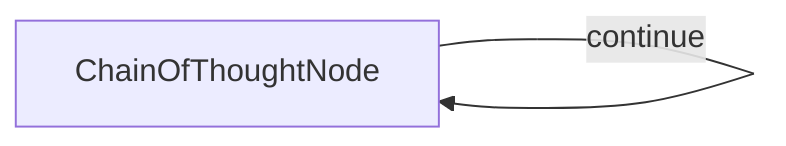

# Chain-of-Thought (C#)

This project demonstrates an implementation that orchestrates a Chain-of-Thought process, enabling LLMs to solve complex reasoning problems by thinking step-by-step. It's designed to improve problem-solving accuracy through deliberate, structured reasoning managed externally.

This implementation is based on: [Build Chain-of-Thought From Scratch - Tutorial for Dummies](https://zacharyhuang.substack.com/p/build-chain-of-thought-from-scratch).

## Features

- Improves model reasoning on complex problems.
- Leverages capable instruction-following models via [Ollama](https://ollama.com) to perform structured Chain-of-Thought reasoning.
- Solves problems that direct prompting often fails on by breaking them down systematically.
- Provides detailed reasoning traces, including step-by-step evaluation and planning, for verification.

## Project Structure

```
Thinking/
├── Thinking.csproj   # Project file
├── Program.cs        # Entry point — builds the flow and runs it (mirrors main.py + flow.py)
├── Nodes.cs          # ChainOfThoughtNode + PlanFormatter helpers (mirrors nodes.py)
├── Utils.cs          # CallLlm wrapper around OllamaConnector (mirrors utils.py)
└── README.md
```

## Getting Started

1. **Install prerequisites:**
   - [.NET 10 SDK](https://dotnet.microsoft.com/download)
   - [Ollama](https://ollama.com) running locally on `http://localhost:11434`

2. **Pull a model** (the default is `gemma3:latest` configured in `SharedUtils/OllamaConnector.cs`):
   ```bash
   ollama pull gemma3:latest
   ```
   You can override the model or host at runtime:
   ```bash
   export OLLAMA_MODEL="llama3.1:latest"
   export OLLAMA_HOST="http://localhost:11434"
   ```

3. **Build the project:**
   ```bash
   dotnet build
   ```

4. **Run the default example:**
   ```bash
   dotnet run --project Thinking
   ```
   The default question is:
   > You keep rolling a fair die until you roll three, four, five in that order consecutively on three rolls. What is the probability that you roll the die an odd number of times?

5. **Run a custom problem:**
   Provide your own reasoning problem using the `--` argument:
   ```bash
   dotnet run --project Thinking -- --"Your complex reasoning problem here"
   ```

## How It Works

The implementation uses a self-looping PocketFlow node (`ChainOfThoughtNode`) that guides an LLM through a structured problem-solving process:



In each loop (thought step), the node directs the LLM to:
1. Evaluate the previous thought's reasoning and results.
2. Execute the next pending step according to a maintained plan.
3. Update the plan, marking the step done (with results) or noting issues.
4. Refine the plan if steps need breaking down or errors require correction.
5. Decide if further thinking (`next_thought_needed`) is required based on the plan state.

This external orchestration enforces a systematic approach, helping models tackle problems that are difficult with a single prompt.

## Node Design

### Shared Store

```csharp
var shared = new Dictionary<string, object>
{
    ["problem"]                = "The problem statement",
    ["thoughts"]               = new List<Dictionary<string, object?>>(),
    ["current_thought_number"] = 0,
    ["solution"]               = null   // filled when the flow ends
};
```

Each thought appended to `shared["thoughts"]` is a `Dictionary<string, object?>` with:

| Key | Type | Description |
|---|---|---|
| `thought_number` | `int` | Sequence number of this thought |
| `current_thinking` | `string` | Detailed evaluation and reasoning text |
| `planning` | `List<object>` | Updated plan structure (YAML-deserialized) |
| `next_thought_needed` | `bool` | Whether the loop should continue |

### ChainOfThoughtNode

| Method | Responsibility |
|---|---|
| `Prep` | Reads the problem and previous thoughts; formats history and last plan for the prompt; increments thought counter |
| `Exec` | Builds the LLM prompt; calls `Utils.CallLlm`; parses the YAML response; validates required keys |
| `Post` | Appends the thought to the shared list; prints progress; returns `"continue"` or `"end"` |

### Plan Step Schema (YAML)

```yaml
- description: "Step description"
  status: "Pending"          # or "Done" / "Verification Needed"
  result: "Concise summary"  # optional, set when Done
  mark: "Reason"             # optional, set when Verification Needed
  sub_steps:                 # optional nested steps
    - description: "Sub-task A"
      status: "Pending"
```

## Comparison with Different Approaches

| Approach | Description |
|---|---|
| **Standard Prompting** | "Think step by step" within a single prompt. Can help, but reasoning may lack depth and the model can lose track. |
| **Native Extended Thinking** | Models like Claude 3.7 or GPT-o1 offer dedicated reasoning modes with strong results. |
| **This Implementation** | Orchestrates a structured Chain-of-Thought using any instruction-following model, managing steps, planning, and evaluation externally. |

## Example Thinking Process

Let's try out this challenging [Jane Street Quant Trading Interview Question](https://www.youtube.com/watch?v=gQJTkuEVPrU):

> **Problem**: You keep rolling a fair die until you roll three, four, five in that order consecutively on three rolls. What is the probability that you roll the die an odd number of times?

This problem demonstrates why structured Chain-of-Thought is valuable:

- **Standard models (single prompt)**: Often get the wrong answer or provide flawed reasoning.
- **Models using native thinking modes**: Can find the correct answer (216/431 ≈ 0.5012).
- **This implementation**: Guides the model towards the correct answer by enforcing a step-by-step plan, evaluation, and refinement loop.

```
🤔 Processing question: You keep rolling a fair die until you roll three, four, five in that
order consecutively on three rolls. What is the probability that you roll the die an odd
number of times?

Thought 1:
  Let me think through this problem by setting up a clear approach.
  ...
  States:
  - State 0: Haven't rolled any of the sequence yet
  - State 1: Just rolled a 3, waiting for 4
  - State 2: Rolled 3 followed by 4, waiting for 5
  - State 3: Success! Rolled the full "3,4,5" sequence

Current Plan Status:
    - [Done] Understand the problem structure: Identified a Markov chain model.
    - [Pending] Set up the Markov model with transition probabilities
    - [Pending] Calculate generating functions / use first-step analysis
    - [Pending] Determine probability of odd number of rolls
    - [Pending] Verify solution
    - [Pending] Conclusion
--------------------------------------------------

...

Thought 7 (Conclusion):
  The final answer is: The probability of rolling the die an odd number of times until
  getting the sequence "3,4,5" is 216/431 ≈ 0.5012.

=== FINAL SOLUTION ===
...216/431 ≈ 0.5012...
======================
```

> **Note:** Even with structured thinking orchestration, models don't always get the right answer on very complex or novel problems. However, this approach significantly improves the robustness of the reasoning process and provides a traceable path for verification and debugging.

